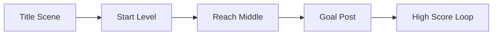

# Analytics & Performance

## Player Retention Funnel

## Scoring Distribution

- **Enemies**: 100 pts (High risk, high reward)
- **Rings**: 10 pts (Consistency)
- **Goal**: 10,000 pts (Level completion)

## Performance Metrics

- **Draw Calls**: Minimized via procedural atlas generation.
- **Physics**: Arcade physics used for 60fps locking on mobile.
- **Memory**: BootScene pre-generates 100% of assets to avoid runtime stutter.
