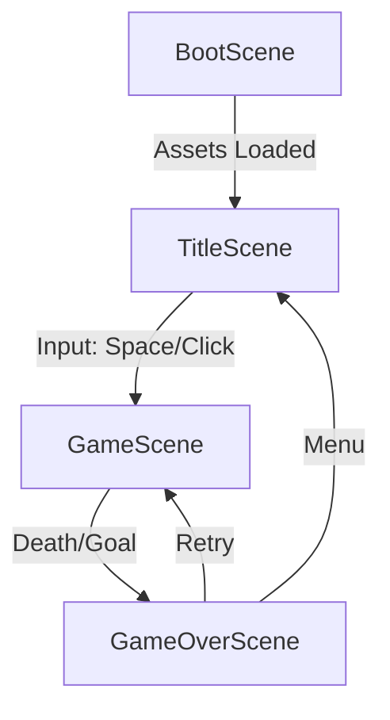
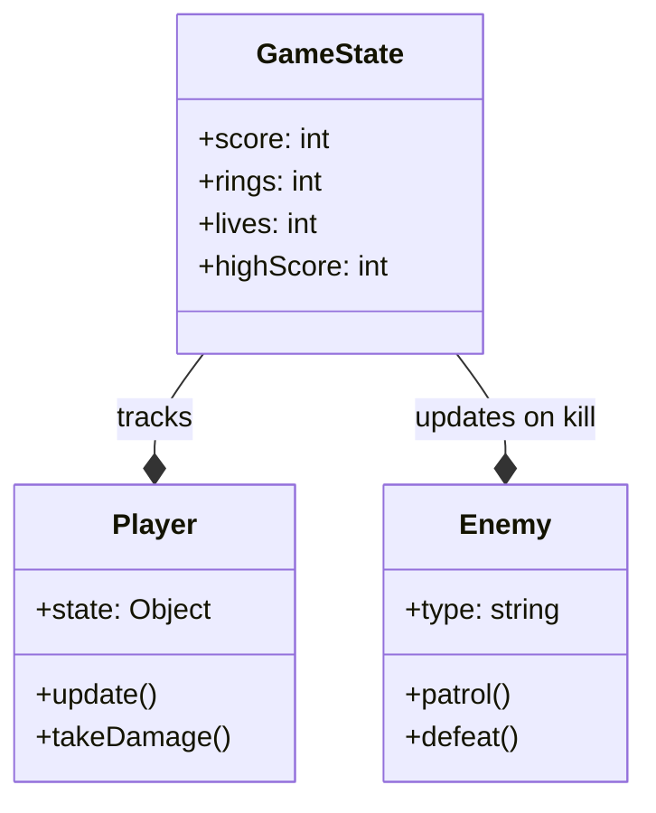

# System Architecture

## Overview

Sonic Rush uses a scene-based architecture provided by Phaser 3, where each stage of the game is handled by a separate class extending `Phaser.Scene`.

## Scene Transition Flow

## Component Hierarchy

- **Game Engine (Phaser 3)**
  - **Main Entry (`main.js`)**
  - **Entities**
    - `Player.js`: Main physics controller
    - `Enemy.js`: AI behavior and patrol logic
    - `Ring.js`: Collectible lifecycle
    - `Monitor.js`: Power-up system
  - **UI System**
    - `HUD.js`: Data visualization (Score, Rings, Time)
  - **Scene Management**
    - Procedural Generation: Custom algorithms for level layout in `GameScene.js`.

## Data Model

