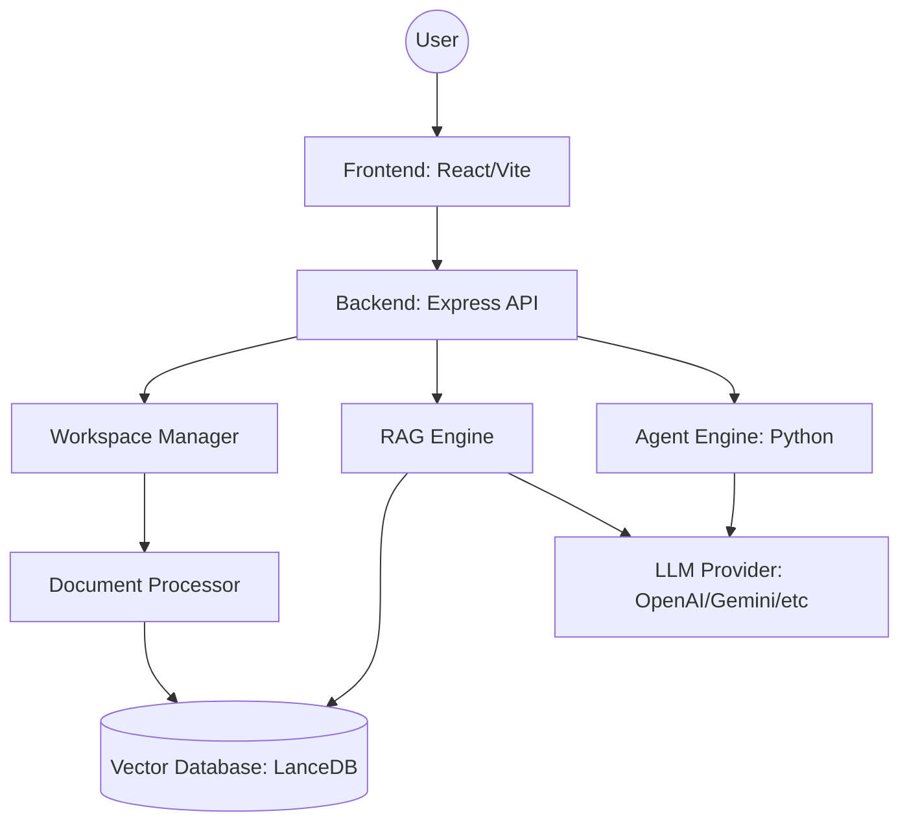
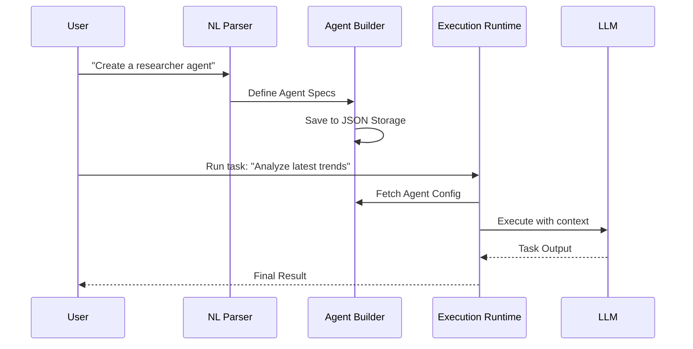

# Architecture & Analytics

## System Architecture

## Agent Lifecycle

## Analytics Data Flow

1. **Input Metrics**: Token usage per agent, document processing time.
2. **Execution Stats**: Task success rate, average latency.
3. **Workspace Insights**: Document count, storage usage, search frequency.
