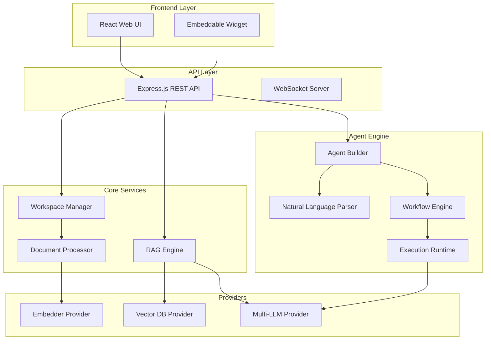

# Jordan Agents - Implementation Plan

A unified AI agent framework featuring zero-code automation and robust RAG & workspace management.

## User Review Required

> [!IMPORTANT] > **Technology Stack Decision**: This plan proposes a hybrid Node.js (frontend/API) + Python (agent engine) architecture. Please confirm if this approach works for you, or if you prefer a different stack.

> [!IMPORTANT] > **Scope Clarification**: This framework is built as a modular standalone project designed for maximum flexibility and performance.

---

---

## Architecture Overview



---

## Proposed Changes

### Component 1: Project Foundation

#### [NEW] [package.json](file:///Users/jordan_mbp/.gemini/antigravity/playground/white-rocket/package.json)

Root monorepo configuration with workspaces for frontend, server, and agent-engine.

#### [NEW] [.env.template](file:///Users/jordan_mbp/.gemini/antigravity/playground/white-rocket/.env.template)

Environment template for API keys (OpenAI, Anthropic, Gemini, Deepseek, Groq, local models).

---

### Component 2: Multi-LLM Provider (`server/providers/`)

Unified interface for 15+ LLM providers from both frameworks:

#### [NEW] [llm-provider.js](file:///Users/jordan_mbp/.gemini/antigravity/playground/white-rocket/server/providers/llm-provider.js)

- Base provider interface with `chat()`, `complete()`, `stream()` methods
- Support for: OpenAI, Anthropic, Gemini, Deepseek, Groq, Ollama, LM Studio, Azure OpenAI, AWS Bedrock, Mistral, Cohere, Together AI, Fireworks AI, OpenRouter, local llama.cpp

#### [NEW] [embedder-provider.js](file:///Users/jordan_mbp/.gemini/antigravity/playground/white-rocket/server/providers/embedder-provider.js)

- Embedding model abstraction (OpenAI, Ollama, local models)

#### [NEW] [vector-db-provider.js](file:///Users/jordan_mbp/.gemini/antigravity/playground/white-rocket/server/providers/vector-db-provider.js)

- Vector DB interface (LanceDB, Chroma, Pinecone, Weaviate, Qdrant, PGVector)

---

### Component 3: Workspace System (`server/workspaces/`)

Features workspace containerization for secure, isolated document management:

#### [NEW] [workspace-manager.js](file:///Users/jordan_mbp/.gemini/antigravity/playground/white-rocket/server/workspaces/workspace-manager.js)

- Create/delete/list workspaces
- Document isolation per workspace
- Workspace-specific agent configurations

#### [NEW] [document-processor.js](file:///Users/jordan_mbp/.gemini/antigravity/playground/white-rocket/server/workspaces/document-processor.js)

- Multi-format support (PDF, TXT, DOCX, MD, CSV, JSON)
- Chunking strategies
- Metadata extraction

---

### Component 4: RAG Engine (`server/rag/`)

#### [NEW] [rag-engine.js](file:///Users/jordan_mbp/.gemini/antigravity/playground/white-rocket/server/rag/rag-engine.js)

- Semantic search across workspace documents
- Configurable retrieval strategies
- Citation generation

---

### Component 5: Agent System (`agent-engine/`)

Core autonomous agent functionality (Python):

#### [NEW] [natural_language_parser.py](file:///Users/jordan_mbp/.gemini/antigravity/playground/white-rocket/agent-engine/core/natural_language_parser.py)

- Parse natural language into agent/tool/workflow definitions
- Intent recognition for agent building commands

#### [NEW] [agent_builder.py](file:///Users/jordan_mbp/.gemini/antigravity/playground/white-rocket/agent-engine/core/agent_builder.py)

- Zero-code agent creation via NL
- Tool generation from descriptions
- Agent template library

#### [NEW] [workflow_engine.py](file:///Users/jordan_mbp/.gemini/antigravity/playground/white-rocket/agent-engine/core/workflow_engine.py)

- Multi-agent workflow orchestration
- DAG-based task execution
- Self-managing workflow generation

#### [NEW] [execution_runtime.py](file:///Users/jordan_mbp/.gemini/antigravity/playground/white-rocket/agent-engine/core/execution_runtime.py)

- Docker-based isolated execution
- Tool invocation and result handling
- Self-play agent optimization

---

### Component 6: API Server (`server/`)

#### [NEW] [index.js](file:///Users/jordan_mbp/.gemini/antigravity/playground/white-rocket/server/index.js)

Express.js server with routes for:

- `/api/workspaces` - Workspace CRUD
- `/api/documents` - Document upload/management
- `/api/chat` - Chat with RAG
- `/api/agents` - Agent CRUD and execution
- `/api/workflows` - Workflow management
- `/api/embed` - Embeddable widget API

---

### Component 7: Frontend (`frontend/`)

#### [NEW] [App.jsx](file:///Users/jordan_mbp/.gemini/antigravity/playground/white-rocket/frontend/src/App.jsx)

React + Vite frontend with pages for:

- Dashboard
- Workspace Management
- Document Upload & RAG Chat
- Agent Editor (natural language)
- Workflow Editor (visual + NL)
- Settings (LLM providers, API keys)

---

### Component 8: Docker & Deployment

#### [NEW] [Dockerfile](file:///Users/jordan_mbp/.gemini/antigravity/playground/white-rocket/Dockerfile)

Multi-stage build for production deployment.

#### [NEW] [docker-compose.yml](file:///Users/jordan_mbp/.gemini/antigravity/playground/white-rocket/docker-compose.yml)

Full stack with optional vector DB services.

---

## Key Feature Breakdown

| Feature                    | Implementation Details                                                  | Jordan Agents |
| -------------------------- | ----------------------------------------------------------------------- | ------------- |
| Zero-code agent building   | Construct agents through pure natural language dialogue                 | ✅            |
| Natural language workflows | Dynamic multi-agent orchestration via NL goals                          | ✅            |
| Workspace isolation        | Containerized document storage per workspace context                    | ✅            |
| Document RAG               | Semantic search with multi-format support (PDF, TXT, etc.)              | ✅            |
| Multi-LLM support          | Unified provider interface (OpenAI, Anthropic, Gemini, etc.)            | ✅            |
| Web UI                     | Premium React-based interface for management and chat                   | ✅            |
| Embeddable widget          | Custom chat widget for external website integration                     | ✅            |
| MCP compatibility          | Full Model Context Protocol support for extended capabilities           | ✅            |
| Docker execution           | Isolated execution environments for agent tasks                         | ✅            |
| Self-play optimization     | Iterative improvement of agent performance via simulated interaction    | ✅            |
| Deep research agents       | Specialized agents for comprehensive information retrieval and analysis | ✅            |

---

## Verification Plan

### Automated Tests

1. **Unit Tests**

   ```bash
   # Server tests
   cd server && npm test

   # Agent engine tests
   cd agent-engine && pytest tests/
   ```

2. **Integration Tests**

   ```bash
   # API integration tests
   npm run test:integration
   ```

3. **E2E Tests (Browser)**
   - Navigate to `http://localhost:3000`
   - Create a workspace
   - Upload a document
   - Chat with RAG and verify citations
   - Create an agent via natural language
   - Execute agent and verify output

### Manual Verification

1. **LLM Provider Testing**: Configure different LLM providers and verify chat works
2. **Document Processing**: Upload PDF, DOCX, TXT files and verify chunking
3. **Agent Creation**: Use natural language to create a simple agent and test execution
4. **Workflow Editor**: Create a multi-step workflow and verify execution order

---

## Implementation Order

1. **Week 1**: Project setup, multi-LLM provider, basic API
2. **Week 2**: Workspace system, document processor, RAG engine
3. **Week 3**: Agent system (builder, workflows, execution)
4. **Week 4**: Frontend UI, embeddable widget
5. **Week 5**: Docker, documentation, testing
